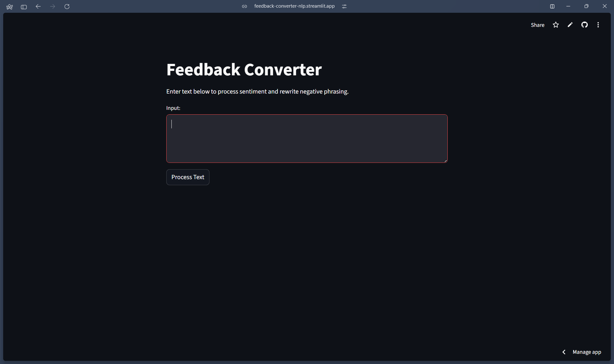

# 💬 Feedback Converter (NLP App)

🚀 **Live App:** [Click here to try it](https://feedback-converter-nlp.streamlit.app)

---

## 🧠 Overview

Feedback Converter is a lightweight NLP-powered web application that analyzes user input and transforms negative feedback into positive, constructive language using sentiment analysis.

---

## ✨ Features

* 🔄 Converts negative sentences into positive phrasing
* 🧠 Uses NLTK VADER for sentiment analysis
* 🎯 Custom antonym-based word replacement
* 🌐 Interactive UI built with Streamlit
* ⚡ Real-time text processing

---

## 📸 Preview


<p align="center">
  
</p>


---

## 🛠️ Tech Stack

* Python
* Streamlit
* NLTK (Natural Language Toolkit)

---

## ▶️ Run Locally

```bash
git clone https://github.com/your-username/feedback-converter-nlp.git
cd feedback-converter-nlp
pip install -r requirements.txt
streamlit run app.py
```

---

## 📌 Example

**Input:**

```
this app is hard and difficult
```

**Output:**

```
this app is easy and effortless
```

---

## 🚀 Deployment

This application is deployed using Streamlit Cloud.

---

## 👤 Author

**Pavan R**

---

## ⭐ Support

If you like this project, consider giving it a ⭐ on GitHub!
